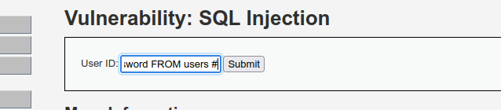
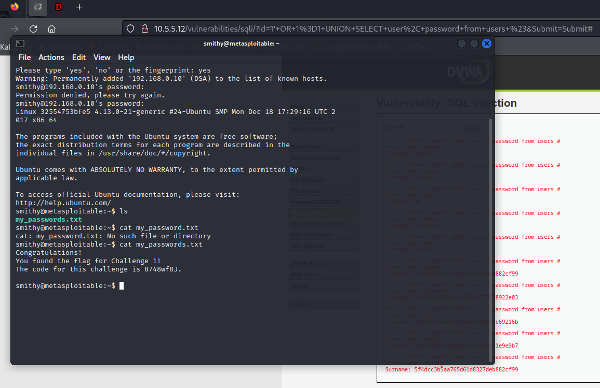
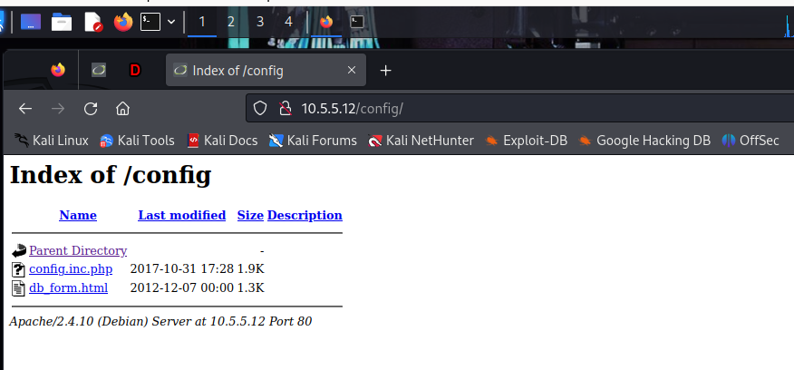
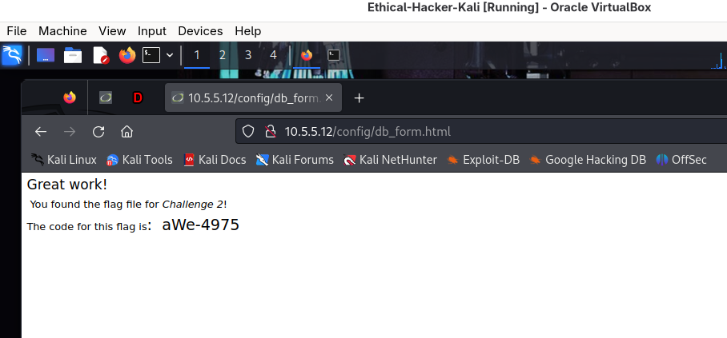
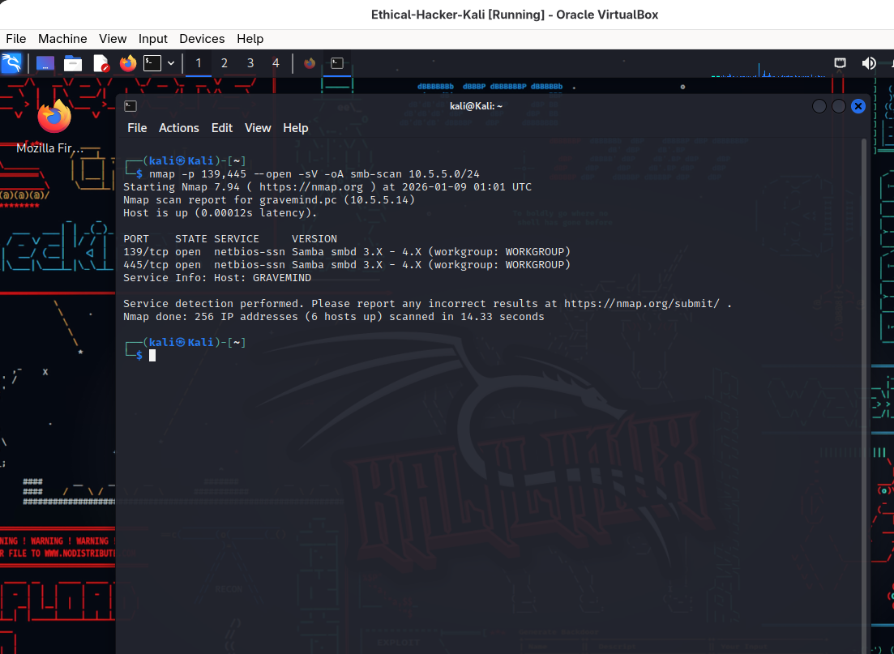
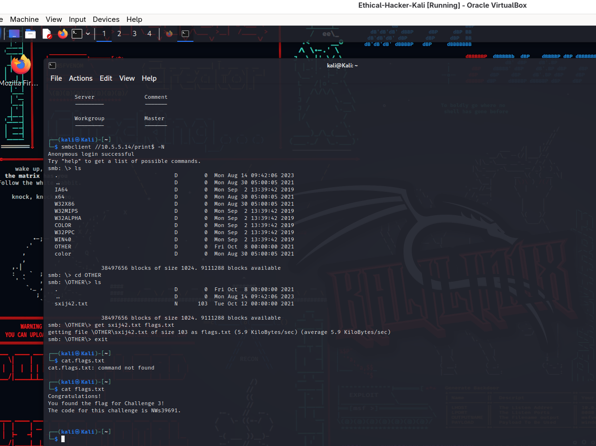
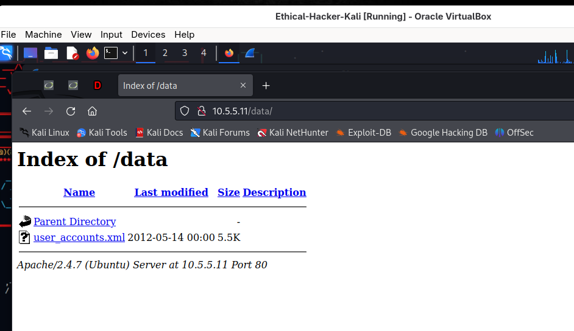

# 🛡️ Capstone Project: Network & Web Application Security Assessment

**Author**  
Wongani Kasawala NKosi

---

# Environment

- Kali Linux (Ethical Hacker Course VM)  
- Target Networks: 10.5.5.0/24, 192.168.0.0/24  
- Tools: Nmap, smbclient, Wireshark, Browser

---

# 📌 Project Overview

This capstone project focuses on practical reconnaissance, enumeration, and vulnerability analysis techniques used in controlled lab environments. The project covers web application enumeration, directory listing analysis, SQL injection remediation, SMB share enumeration, and packet capture (PCAP) analysis.

All activities were conducted in a controlled lab environment for educational purposes only.

---

# 🎯 Objectives

- Identify exposed web directories and sensitive files  
- Analyze common web vulnerabilities and propose remediation  
- Enumerate SMB services and unsecured file shares  
- Analyze network traffic using PCAP files  
- Document findings and security recommendations

---

# 🧰 Tools & Technologies Used

- Nmap (service discovery & enumeration)  
- smbclient / enum scripts / smbmap  
- Wireshark / tshark / tcpflow  
- sqlmap, john/hashcat  
- Web browser (manual inspection)  
- Linux (Kali)

---

# 🧪 Challenge 1: SQL Injection

**Vulnerability Identified**  
SQL Injection in DVWA (Low Security)

**Key Actions**

- Identified vulnerable input field  
  

- Extracted credentials from users table  
  

- Cracked MD5 password hash  
  

- Logged in as Bob Smith via SSH and read flag file  
  

**Findings**

- Username: smithy  
- Password: password  
- Flag File Location: `/home/smithy/`  
- Flag Filename: `my_passwords.txt`  
- Flag code: `8748wf8j`

**SQL Injection Remediation**

- Use prepared statements / parameterized queries  
- Input validation and sanitization (whitelisting)  
- Principle of least privilege for database accounts  
- Hide detailed SQL error messages from users  
- Use secure password hashing (bcrypt / Argon2)

---

# 🌐 Challenge 2: Web Server Vulnerabilities

**Vulnerability Identified**  
Directory listing enabled on Apache web server

**Reconnaissance Command**
```bash
nmap --script http-enum -p 80 10.5.5.12
```


**Example: Checking `/config/` path and finding flag**
  


**Accessible Directories (discovered)**

- `/config/`  
- `/docs/`  
- `/external/`

**Flag Discovery**

- Location: `/config/db_form.html`  
- Filename: `db_form.html`  
- Flag code: `aWe-4975`

**How this was found (summary of steps)**

1. Confirm DVWA is accessible and security set to low (for Challenge 1 tasks).  
2. Run `gobuster` to enumerate directories:
   ```bash
   gobuster dir -u http://10.5.5.12 -w /usr/share/wordlists/dirb/common.txt -t 40 -x php,html,txt
   ```
   Save `gobuster` output screenshot: `capstone/images/gobuster_results.png`.  
3. Visit discovered directory in browser (e.g., http://10.5.5.12/config/) and look for "Index of /config/" or links to files.  
4. Click or curl the file `db_form.html` and read contents to extract the flag code.

**Directory Listing Remediation**

- Disable directory indexing in server config (Apache: `Options -Indexes`, nginx: `autoindex off`)  
- Add default index files (e.g., `index.html`) or return proper 403/404 responses for non-authorized access  
- Remove sensitive temporary/backup files from the webroot and enforce least-privilege file permissions

---

# 🗄️ Challenge 3: SMB Enumeration

**SMB Host Identified**

- IP Address: `10.5.5.14`  
- Ports: 139, 445 (Samba)

**Enumeration Commands**
```bash
nmap -p 139,445 --open -sV -oA smb-scan 10.5.5.0/24
nmap --script smb-enum-shares.nse -p 445 10.5.5.14
smbclient -L //10.5.5.14 -N
smbclient //10.5.5.14/$print -N
```


**Exploration & Files Found**  
Examples of listings and files found while exploring shares (see `capstone/images/`):

  


**Shares Found (from enumeration)**

- `homes`  
- `workfiles`  
- `print$`  
- `IPC$`

**Anonymous Access Confirmed**

- `workfiles`  
- `print$`  
- `IPC$`

**Challenge 3 Flag**

- Share: `print$`  
- Filename: `sxij42.txt`  
- Flag Code: `NWs39691`

**How this was found (summary of steps)**

1. Nmap showed `10.5.5.14` responding on SMB ports with Samba.  
2. `smb-enum-shares.nse` confirmed shares and indicated anonymous READ/WRITE access for several shares.  
3. `smbclient` connected to accessible shares using `-N` (no password) and `ls`/`cd`/`get` was used to locate and download challenge files.  
4. If a share appears empty at root, `recurse` or mounting with CIFS and running `find` can reveal nested files.

**SMB Remediation**

- Disable anonymous/guest access and remove “Everyone/Guest” permissions from shares  
- Restrict SMB exposure using firewall rules (allow SMB only on trusted internal networks), disable SMBv1, enable SMB signing and require authenticated accounts; keep Samba/Windows patched

---

# 📡 Challenge 4: PCAP Analysis

**File Analyzed**  
`SA.pcap` (located in `~/Downloads/SA.pcap`)

**Tools**  
Wireshark, tshark, tcpflow

**Findings**

- Target IP Address: `10.5.5.11`  
- Directories observed in HTTP requests:
  - `/test/`, `/data/`, `/includes/`, `/passwords/`, `/styles/`, `/javascript/`, `/webservices/`  
  

- Flag URL discovered in the capture:  
  `http://10.5.5.11/data/user_accounts.xml`  
  

- Flag file contents (exported from PCAP / downloaded):  
  

- Flag Code: `21z-1478K`

**How this was found (summary of steps)**

1. Open `SA.pcap` in Wireshark: `wireshark ~/Downloads/SA.pcap`.  
2. Use filter `http.request` to find GETs. Note `Host` and `Request URI` fields.  
3. Export HTTP object (File → Export Objects → HTTP) or Follow TCP Stream on the response to reconstruct file content.  
4. If using CLI: `tshark -r ~/Downloads/SA.pcap -Y "http.request" -T fields -e ip.dst -e http.host -e http.request.uri` to list unique requests.

**PCAP Remediation**

- Use HTTPS/TLS for all web traffic to prevent sensitive file contents and credentials from being transmitted in cleartext  
- Use secure file transfer (SFTP/FTPS) or application-layer encryption for sensitive data; monitor and limit plaintext protocols on the network

---

# 🧠 Key Takeaways

- Misconfigurations and default/weak settings lead to serious data exposure  
- Anonymous/guest access is a critical security risk and must be disabled if not required  
- Encryption (TLS) is essential to protect data in transit  
- Defense-in-depth (firewalls, ACLs, WAFs, least privilege) reduces impact of single vulnerabilities

---

# ⚠️ Disclaimer

All activities were performed in an authorized lab environment for educational purposes only. Do not apply these techniques against systems you do not own or have explicit permission to test.

---

# 📁 Where to find artifacts in this repo

- `capstone/answers.md` — template and where to paste discovered flags & values  
- `capstone/images/` — screenshots referenced above (place images here using the filenames in this README)

---
